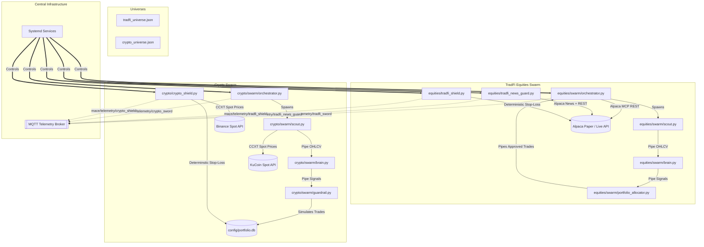
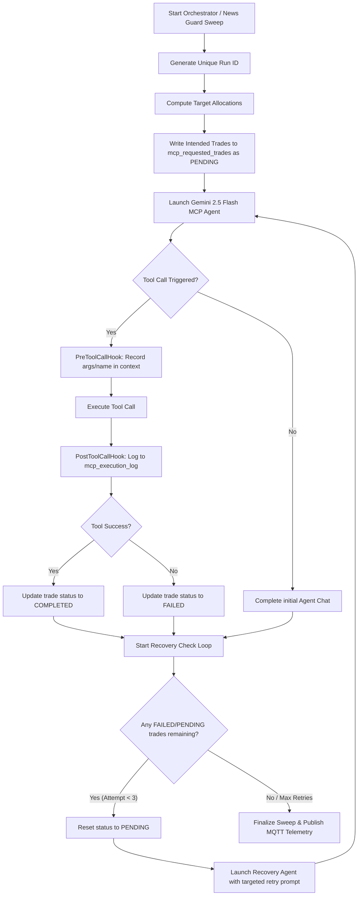

[mace_system_review.md](https://github.com/user-attachments/files/29602195/mace_system_review.md)
# M.A.C.E. (Momentum Autonomous Cognitive Engine) System Review

The **Momentum Autonomous Cognitive Engine (M.A.C.E.)** is a highly modular, multi-agent algorithmic trading infrastructure designed for decentralized cryptocurrency trading and TradFi equity markets. It combines state-of-the-art quantitative mathematical models (Gaussian Hidden Markov Models and dynamic fractional Kelly sizing) with autonomous qualitative risk analysis driven by large language models (LLMs).

This document provides an in-depth technical analysis of M.A.C.E.’s architecture, data flows, subsystems, strengths, and areas for improvement.

---

## 1. System Architecture Diagram

The diagram below illustrates the decoupled pipeline model of M.A.C.E., showcasing the division of labor between data scouts, quantitative brains, portfolio risk managers, and deterministic stop-loss shields.

---

## 2. Core Subsystems

### A. TradFi Equities Swarm
The TradFi pipeline operates on a periodic cycle (1h intervals in daemon mode), reading from a universe of 100 blue-chip stocks ([tradfi_universe.json](file:///mnt/MACE/config/tradfi_universe.json)).

1. **Data Scout ([scout.py](file:///mnt/MACE/equities/swarm/scout.py))**: An asynchronous data collector that fetches the last 2 years of daily OHLCV bar data from Alpaca's market data API and outputs a clean JSON payload to standard output.
2. **Quant Brain ([brain.py](file:///mnt/MACE/equities/swarm/brain.py))**: A math engine that consumes the Scout's output via standard input. It computes:
   - Rolling 20-day returns and 20-day volatility.
   - An empirical Markov transition matrix mapping historical state transitions (Bull, Bear, Sideways).
   - An independent **3-State Gaussian Hidden Markov Model (HMM)** fitted on returns and volatility to "confirm" the market regime.
   - A **Dynamic Half-Kelly Sizing** parameter based on backtested historical win-rates, scaled by signal strength (a Sharpe ratio proxy) and capped at 25%.
3. **Portfolio Allocator ([portfolio_allocator.py](file:///mnt/MACE/equities/swarm/portfolio_allocator.py))**: Takes the outputs of all candidate brains, filters out assets not confirmed to be in a "Bull" regime, clamps individual trade sizes to a maximum of 20% of total equity, and normalizes positions to fit within a 90% deployable cash limit.
4. **Orchestrator ([orchestrator.py](file:///mnt/MACE/equities/swarm/orchestrator.py))**: Manages the pipeline workflow. When trades are approved:
   - **Sell orders** are submitted first via an autonomous Google Antigravity Agent (Gemini 2.5 Flash) connected to an `alpaca-mcp-server` command.
   - **Buy orders** are placed next using the same agent, executing market orders based on the computed sizing in USD.
   - Emits structured state telemetry to the local MQTT broker.

### B. Crypto Swarm
The crypto pipeline is designed around a simulated multi-chain sandbox and runs on 4-hour UTC boundaries.

1. **Data Scout ([scout.py](file:///mnt/MACE/crypto/swarm/scout.py))**: Uses CCXT to fetch exactly 3 months (540 4-hour candles) of spot OHLCV data from KuCoin.
2. **Quant Brain ([brain.py](file:///mnt/MACE/crypto/swarm/brain.py))**: A pure 3-State Gaussian HMM fitted on 2D returns and rolling standard deviations. It calculates a Sharpe-scaled Half-Kelly fraction for assets in the "Bull" state.
3. **Guardrail / Virtual Ledger ([guardrail.py](file:///mnt/MACE/crypto/swarm/guardrail.py))**: Since crypto execution is simulated in this environment, this module acts as a **virtual ledger** backed by an SQLite database ([portfolio.db](file:///mnt/MACE/config/portfolio.db)). It stores:
   - Simulated wallet public keys and gas balances for Solana and Arbitrum.
   - Active coin balances, average entry prices, and available USDT cash (initialized at $10,000 USDT).
   - Applies portfolio constraints (max 25% single-asset exposure, min $10 trade sizing) and executes simulated BUY/SELL trades directly against the DB ledger.
4. **Orchestrator ([orchestrator.py](file:///mnt/MACE/crypto/swarm/orchestrator.py))**: Loops through the crypto universe on UTC HH:05:00 boundaries, pipes OHLCV data into the brain subprocesses concurrently (capped with a semaphore of 10), evaluates results through the Guardrail, and dispatches telemetry.

---

## 3. Risk Mitigation Shields

M.A.C.E. implements three parallel, asynchronous risk mitigation layers to protect capital against both sudden mathematical price drops and qualitative market panics.

### I. Volatility-Calibrated Crypto Shield ([crypto_shield.py](file:///mnt/MACE/crypto/crypto_shield.py))
* **Interval**: Runs every 15 minutes as a systemd service.
* **Mechanism**: Pulls active holdings from `portfolio.db`, fetches live spot prices via CCXT (KuCoin with Binance failover), and queries the `crypto_hwm` table.
* **Rule**: Enforces a dynamic, volatility-calibrated trailing stop-loss (calibrated by the scout between a tight **3.0% and 8.0% limit** based on 3-Sigma historical log returns of 1h candles over 30 days).
* **Action**: If the drawdown from the High-Water Mark (HWM) breaches the limit, liquidates the position, resets HWM tracking, and returns recovered cash to the USDT wallet. Dynamically ratchets the HWM up if prices set new peaks.

### II. Deterministic TradFi Shield ([tradfi_shield.py](file:///mnt/MACE/equities/tradfi_shield.py))
* **Interval**: Runs every 1 minute.
* **Mechanism**: Connects to the Alpaca REST API.
* **Rule 1 (Portfolio-wide)**: If overall unrealized portfolio drawdown exceeds **5%**, triggers **full emergency liquidation** by closing all open positions.
* **Rule 2 (Single Asset)**: If any individual stock drawdown exceeds **8%**, closes that specific position.

### III. Qualitative TradFi News Guard ([tradfi_news_guard.py](file:///mnt/MACE/equities/tradfi_news_guard.py))
* **Interval**: Runs every 4 hours.
* **Mechanism**: Leverages LLMs to evaluate unstructured risk factors.
* **Workflow**:
  1. Fetches current Alpaca stock holdings.
  2. Queries the Alpaca Data API for the top 10 latest news headlines for those stocks.
  3. Hands the aggregated context to a Gemini 2.5 Flash agent.
  4. The agent acts as an autonomous qualitative analyst, ignoring normal volatility but scanning for **existential threats** (e.g., bankruptcy, SEC fraud investigations, catastrophic product failures, CEO arrests).
  5. If a severe threat is found, the agent uses the `alpaca-mcp-server` to execute `mcp_alpaca_close_position` for that symbol immediately.

---

## 4. Telemetry and System Control

All services run as background daemons orchestrated by Systemd configurations. They report real-time analytics to a centralized MQTT broker, allowing external dashboards to monitor system state.

### System Control Commands
* **Start Fleet**: [`start_all.sh`](file:///mnt/MACE/start_all.sh)
* **Stop Fleet**: [`stop_all.sh`](file:///mnt/MACE/stop_all.sh)

| Daemon Service | Target Script | Run Frequency | Telemetry Topic |
| :--- | :--- | :--- | :--- |
| `mace-crypto-shield.service` | `crypto/crypto_shield.py` | 15 minutes | `mace/telemetry/crypto_shield` |
| `mace-tradfi-shield.service` | `equities/tradfi_shield.py` | 1 minute | `mace/telemetry/tradfi_shield` |
| `mace-crypto-orchestrator.service` | `crypto/swarm/orchestrator.py` | 4 hours (UTC synchronized) | `mace/telemetry/crypto_sword` |
| `mace-equities-orchestrator.service` | `equities/swarm/orchestrator.py` | 1 hour | `mace/telemetry/tradfi_sword` |
| `mace-tradfi-news-guard.service` | `equities/tradfi_news_guard.py` | 4 hours | `mace/telemetry/tradfi_news_guard` |

---

## 5. Architectural Strengths

* **Unix Piping & Low Coupling**: The Scout, Brain, and Allocator/Guardrail subcomponents communicate strictly via standard Unix I/O piping. This provides high isolation—making it easy to swap out the quantitative HMM model in `brain.py` with a deep-learning or statistical model without rewriting any data collection or risk management code.
* **Centralized Risk Allocation**: Sizing is decoupled from individual alpha generation. No single agent can over-allocate capital because the final decisions are evaluated by a centralized Allocator that respects total account equity and cash budgets.
* **Sharpe-Scaled Sizing**: Using the ratio of rolling returns over rolling standard deviations (Sharpe proxy) as a confidence scaling multiplier for Half-Kelly sizing is a highly effective, modern approach to protecting capital from low-volatility traps.
* **Hybrid Risk Paradigm**: Combining deterministic stop-losses (Shields) with qualitative sentiment analysis (News Guard) protects the fund against both instant flash crashes and slow-burning fundamental deterioration (like structural fraud or SEC crackdowns).

---

## 6. Recommendations for Improvement

> [!NOTE]
> Below are structural optimizations and operational enhancements that can be made to increase reliability and scalability.

1. **SQLite Concurrent Write Safety** [RESOLVED]:
   * Previously, `portfolio.db` suffered from write failures due to a faulty `?nolock=1` SQLite parameter and connection leaks when scripts encountered exceptions.
   * *Resolution*: Removed `?nolock=1` (which blocks write transactions), implemented standard SQLite connections with a robust `timeout=30.0` retry queue, and added strict try/finally cleanup structures to prevent resource leaks under exceptions.

2. **API Rate-Limiting & Jitter Management**:
   * The equities orchestrator scans assets in parallel. Although defensive rate-limiting spacing (`asyncio.sleep(0.2)`) and semaphore limiting are applied, large universes can still hit Alpaca and CCXT rate-limits.
   * *Recommendation*: Implement centralized token-bucket rate limiters in the scouts or coordinate queries using global connection pools.

3. **Error Resilience in MCP Sessions** [RESOLVED]:
   * Previously, `execute_mcp_agent` relied on raw network retries but lacked structured recovery from partial execution failures (e.g. if one order fails while others succeed).
   * *Resolution*: Implemented lifecycle hooks (`PreToolCall`, `PostToolCall`, `OnToolError`) backed by a persistent execution log (`mcp_requested_trades` and `mcp_execution_log`) to track intended vs. executed trades. Added an automated recovery loop that detects failed trades and dispatches up to 3 retries using a targeted recovery agent.

---

## 7. MCP Session Error Resilience & Automated Recovery

To prevent partial execution failures (e.g., half-filled sweeps or failed liquidations), the system integrates structured lifecycle hooks from the Google Antigravity SDK and a persistent recovery state engine.

### Lifecycle Hooks
- **`MACEPreToolCallHook`**: Intercepts the tool call before dispatching to capture arguments and store them in the operational context.
- **`MACEPostToolCallHook`**: Logs the tool execution status, parameters, and result to `mcp_execution_log` (linked via `trade_id` foreign key) and updates the matching request status to `COMPLETED` or `FAILED`.
- **`MACEToolErrorHook`**: Intercepts unhandled tool exceptions and registers them as `FAILED` execution records.

