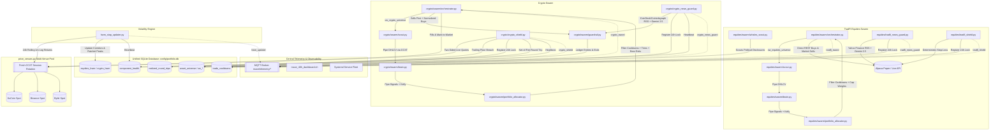

# M.A.C.E. (Momentum Autonomous Cognitive Engine)

The **Momentum Autonomous Cognitive Engine (M.A.C.E.)** is a modular, multi-agent quantitative trading system operating across decentralized cryptocurrency markets and TradFi equity markets (Alpaca multi-broker abstraction). It integrates state-of-the-art quantitative mathematical models (Gaussian Hidden Markov Models and dynamic fractional Kelly sizing) with autonomous qualitative risk governance driven by large language models (LLMs), deterministic high-water mark trailing stops, multi-venue exchange resilience, and unified relational SQLite persistence with real-time MQTT telemetry.

---

## 1. System Architecture Diagram

The diagram below illustrates the decoupled pipeline model of M.A.C.E. v1.5, showcasing the division of labor between data scouts, quantitative brains, portfolio risk managers, multi-venue price pools, and deterministic stop-loss shields.


```mermaid
graph TD
    %% Unified Persistence
    subgraph Storage [Unified SQLite Database: config/portfolio.db]
        DB_Univ[(asset_universe / vw_*)]
        DB_HWM[(equities_hwm / crypto_hwm)]
        DB_Cooldown[(trade_cooldowns)]
        DB_Trips[(realized_round_trips)]
        DB_Health[(component_health)]
    end

    %% TradFi Subsystem
    subgraph TradFi Subsystem [TradFi Equities Swarm]
        T_Whales[equities/swarm/whales_scout.py]
        T_Orch[equities/swarm/orchestrator.py]
        T_Scout[equities/swarm/scout.py]
        T_Brain[equities/swarm/brain.py]
        T_Alloc[equities/swarm/portfolio_allocator.py]
        T_News[equities/tradfi_news_guard.py]
        T_Shield[equities/tradfi_shield.py]
        
        T_Whales -->|Scouts Political Disclosures| DB_Univ
        T_Orch -->|vw_equities_universe| T_Scout
        T_Scout -->|Pipe OHLCV| T_Brain
        T_Brain -->|Pipe Signals + Kelly| T_Alloc
        T_Alloc -->|Filter Cooldowns + Cap Weights| T_Orch
        
        T_Orch -->|Direct REST Buys & Market Sells| Alpaca_API[(Alpaca Paper / Live API)]
        T_News -->|Yahoo Finance RSS + Gemini 2.5| Alpaca_API
        T_Shield -->|Deterministic Stop-Loss| Alpaca_API
        T_Shield -->|Register 24h Lock| DB_Cooldown
        T_News -->|Register 24h Lock| DB_Cooldown
    end

    %% Multi-Venue Price Pool
    subgraph Venue Pool [price_venues.py Multi-Venue Pool]
        P_Pool[[Fresh CCXT Session Rotation]]
        P_KuCoin[(KuCoin Spot)]
        P_Binance[(Binance Spot)]
        P_Bybit[(Bybit Spot)]
        P_Pool --> P_KuCoin
        P_Pool --> P_Binance
        P_Pool --> P_Bybit
    end

    %% Crypto Subsystem
    subgraph Crypto Subsystem [Crypto Swarm]
        C_Orch[crypto/swarm/orchestrator.py]
        C_Scout[crypto/swarm/scout.py]
        C_Brain[crypto/swarm/brain.py]
        C_Alloc[crypto/swarm/portfolio_allocator.py]
        C_Guard[crypto/swarm/guardrail.py]
        C_Shield[crypto/crypto_shield.py]
        C_News[crypto/crypto_news_guard.py]
        
        C_Orch -->|vw_crypto_universe| C_Scout
        C_Scout -->|Pipe OHLCV via CCXT| C_Brain
        C_Brain -->|Pipe Signals + Kelly| C_Alloc
        C_Alloc -->|Filter Cooldowns + Trims + Bear Exits| C_Orch
        C_Orch -->|Sells First + Normalized Buys| C_Guard
        C_Guard -->|Ledger Entries & Exits| DB_Univ
        C_Orch -->|Fills & Mark-to-Market| P_Pool
        
        C_News -->|CoinDesk/Cointelegraph RSS + Gemini 2.5| C_Guard
        C_News -->|Register 24h Lock| DB_Cooldown
        C_News -->|Heartbeat| DB_Health
        
        C_Shield -->|Two-Sided Live Quotes| P_Pool
        C_Shield -->|Trailing Floor Breach| DB_Univ
        C_Shield -->|Register 24h Lock| DB_Cooldown
        C_Shield -->|Net-of-Fee Round Trip| DB_Trips
        C_Shield -->|Heartbeat| DB_Health
    end

    %% HWM Engine
    subgraph Volatility Engine
        HWM_Engine[hwm_stop_updater.py]
        HWM_Engine -->|24h Rolling 1m Log Returns| P_Pool
        HWM_Engine -->|Update Corridors & Ratchet Peaks| DB_HWM
        HWM_Engine -->|Heartbeat| DB_Health
    end

    %% Telemetry & Monitoring
    subgraph Monitoring [Central Telemetry & Observability]
        MQTT_Broker[[MQTT Broker: mace/telemetry/*]]
        Dashboard[mace_48h_dashboard.sh]
        Systemd[Systemd Service Fleet]
    end

    T_Orch -.->|tradfi_sword| MQTT_Broker
    T_News -.->|tradfi_news_guard| MQTT_Broker
    T_Shield -.->|tradfi_shield| MQTT_Broker
    C_Orch -.->|crypto_sword| MQTT_Broker
    C_News -.->|crypto_news_guard| MQTT_Broker
    C_Shield -.->|crypto_shield| MQTT_Broker
    HWM_Engine -.->|hwm_updater| MQTT_Broker
```

---

## 2. Core Subsystems

### A. TradFi Equities Swarm
The TradFi pipeline operates on a periodic cycle (configurable interval, default 900s / 15m in production daemon mode) reading from `vw_equities_universe`.

1. **Whales & Political Disclosure Scout ([whales_scout.py](equities/swarm/whales_scout.py))**:
   - 5-tier redundant scraper for political, congressional, and smart-money trade disclosures:
     1. Finnhub REST API (`/stock/insider-transactions`)
     2. House & Senate Stock Watcher (Public JSON endpoints)
     3. RapidAPI Politician Trade Tracker
     4. Apify CapitolTrades Actor
     5. CapitolTrades direct HTML scraper (BeautifulSoup fallback)
   - Normalizes symbols into `equities_whale_universe` with conviction multipliers (`KELLY_WHALE_MULT=1.25` vs `KELLY_STATIC_MULT=1.00`).
2. **Data Scout ([scout.py](equities/swarm/scout.py))**:
   - Asynchronous data collector fetching 200 daily OHLCV bars via Alpaca's Market Data API (`iex` feed with automatic 403 fallback).
3. **Quant Brain ([brain.py](equities/swarm/brain.py))**:
   - Rolling 20-day returns and 20-day annualized volatility features.
   - **3-State Gaussian Hidden Markov Model (HMM)** classifying market regimes (`Bull`, `Bear`, `Neutral`).
   - **Honest Empirical Kelly Sizing (v1.3 / v1.4)**: Win-rate and payoff priors are shrinkage-blended with genuine realized round trips from `realized_round_trips` (via `MACE_EMPIRICAL_KELLY_JSON`). Payoff ratios are clamped between `[0.5, 3.0]` with an $N \ge 10$ sample threshold (v1.4) to eliminate single-win distortions.
   - Scaled by confidence multiplier (rolling Sharpe proxy) and bounded at 25%.
4. **Portfolio Allocator ([portfolio_allocator.py](equities/swarm/portfolio_allocator.py))**:
   - Filters out non-Bull regimes and assets in `vw_active_cooldowns`.
   - Clamps individual allocations to $\le 20\%$ total equity and normalizes total deployment to $90\%$ available cash.
   - **Routine Profit-Taking Trims**: Audits held positions; generates partial market `SELL` orders if an asset surges $>15\%$ over its target Kelly weight (without triggering a risk cooldown lock).
5. **Orchestrator ([orchestrator.py](equities/swarm/orchestrator.py))**:
   - **Direct REST Execution**: Sells dispatched first (profit-taking trims and stop liquidations); buys placed next via Alpaca REST with notional formatted strictly to 2 decimal places (v1.3.2 HTTP 42210000 resolution).
   - **Off-Hours Buy Gate (v1.3.3)**: Suppresses equity buy sweeps when US cash markets are closed, avoiding queued market-order slippage.
   - **Duplicate Buy Gate (v1.3.3)**: Prevents repeated re-buying within the same evaluation window or when already allocated.
   - **Fail-Neutral News Gate (v1.3)**: If the TradFi news guard heartbeat in `component_health` is older than `MACE_NEWS_STALENESS_HOURS` (12h) or marked degraded, new entries are **held** while sell, trim, and stop-loss paths remain fully operational.

### B. Crypto Swarm
The crypto pipeline operates on a simulated multi-chain sandbox and evaluates assets on 4-hour UTC boundaries.

1. **Data Scout ([scout.py](crypto/swarm/scout.py))**:
   - Fetches 3 months (540 4-hour candles) of spot OHLCV data using CCXT across the venue pool.
2. **Quant Brain ([brain.py](crypto/swarm/brain.py))**:
   - Pure 3-State Gaussian HMM fitted on 2D return/volatility features.
   - Computes shrinkage-blended empirical Kelly fractions for Bull-state candidates using shared math from `realized_round_trips.py`.
3. **Portfolio Allocator ([portfolio_allocator.py](crypto/swarm/portfolio_allocator.py), v1.5)**:
   - Modernized to feature parity with the TradFi equities allocator:
     - **Active Cooldown Filter**: Checks `vw_active_cooldowns` to immediately reject quarantined tokens.
     - **72h Post-Stopout Probation Gate**: Candidates whose cooldown expired within the last 72 hours must show double conviction (`kelly >= 0.10`) to re-enter, ending mechanical churn loops (e.g. BONK whipsaw).
     - **Bear-Regime Full Liquidation Orders**: Held tokens flipping to Bear state emit `BEAR_REGIME_LIQUIDATION` sell orders before buy sizing.
     - **Routine Profit-Taking Trims (`TRIM_PROFIT_TAKING`)**: Audits held positions; emits partial sell orders if a token surges $>15\%$ over its target Kelly dollar weight without triggering cooldown locks.
     - **Total Equity Kelly Sizing & Budget Normalization**: Sizing calculated against `total_equity`, capped at `KELLY_HARD_CAP` (default 12%), and normalized to 90% deployable liquid cash pool.
4. **Guardrail / Virtual Ledger ([guardrail.py](crypto/swarm/guardrail.py), v1.5)**:
   - SQLite-backed virtual ledger in `config/portfolio.db` tracking gas balances (Solana, Arbitrum) and active token positions.
   - **Taker Fee Accounting (v1.3)**: Deducts a configurable taker fee (`MACE_TAKER_FEE=0.001`, 0.1%) on all entries (fee-inclusive cost basis) and exits (net USDT recovery).
   - **Allocator Sizing Preservation (v1.5)**: `run_piped_risk_gate()` honors pre-computed normalized target dollar sizes from the allocator.
   - **Realized Round Trips**: Logs every exit with basis `ledger_exact` (including trims with reason `TRIM_PROFIT_TAKING`) to `realized_round_trips`.
5. **Orchestrator ([orchestrator.py](crypto/swarm/orchestrator.py), v1.5)**:
   - Evaluates universe candidates concurrently with an async semaphore of 10.
   - **Sells Executed First (v1.5)**: All sell orders (profit-taking trims and Bear liquidations) execute prior to new buys, freeing USDT liquidity and reducing risk exposure.
   - **Fail-Neutral News Gate (v1.5)**: Holds new buy allocations if the Crypto News Guard heartbeat is degraded or older than 12 hours (`MACE_NEWS_STALENESS_HOURS`). Sells, trims, and stop-outs remain active.
   - **Multi-Venue Pricing Pool (`price_venues.py`, v1.3 / v1.4)**: Live fills mark against KuCoin $\to$ Binance $\to$ Bybit using fresh CCXT instances per fetch.
   - **Stale Ledger Write-Down Purge (v1.3)**: Positions that cannot be priced by any pool venue for 3 consecutive sweeps are written down at $-100\%$ loss to prevent zombie holdings.

---

## 3. Risk Mitigation Shields & Volatility Engine

M.A.C.E. implements four parallel, asynchronous risk mitigation layers to protect capital against price drops, exchange feed failures, and fundamental market panics.

### I. Volatility-Calibrated Crypto Shield ([crypto_shield.py](crypto/crypto_shield.py))
* **Cadence**: Runs every 15 minutes as a systemd service.
* **Mechanism**: Pulls active positions from `portfolio.db`, queries `vw_crypto_risk_corridors`, and executes real-time stop-loss checks.
* **Feed Resilience (v1.4)**:
  - Live pricing queries the multi-venue pool (`price_venues.py`) with `two_sided=True` (requires non-zero bid/ask to prevent ghost-ticker liquidations on halted coins).
  - Eliminates long-lived exchange sessions that degrade at the transport/WAF level; instantiates fresh CCXT sessions per fetch.
  - **Per-Position Crash Isolation**: Individual token lookup or database faults are caught locally without aborting sweeps for remaining positions.
  - **Deterministic DB Connection Cleanup**: Strict `try/finally` blocks ensure SQLite handles are closed on all execution paths.
* **Stop-Loss Action**:
  - Liquidates position directly against the virtual ledger.
  - Deducts taker fee (`MACE_TAKER_FEE`) so USDT recovery reflects real net proceeds.
  - Inserts 24-hour quarantine into `trade_cooldowns` (`reason: STOP_LOSS_BREACH`).
  - Records completed exit in `realized_round_trips` (`basis: ledger_exact`).
  - Emits telemetry and records heartbeat in `component_health`.

### II. Deterministic TradFi Shield ([tradfi_shield.py](equities/tradfi_shield.py))
* **Cadence**: Runs every 60 seconds as a systemd service.
* **Mechanism**: Direct connection to Alpaca REST API.
* **Rule 1 (Portfolio-wide)**: If total portfolio drawdown breaches **5%**, triggers emergency liquidation across all open equities.
* **Rule 2 (Corridor Stop)**: Closes any asset breaching its dynamic trailing stop floor from `vw_equities_risk_corridors` (volatility-calibrated between 5% and 12%).
* **Cooldown**: Inserts a 24-hour cooldown lock into `trade_cooldowns`.

### III. Qualitative TradFi News Guard ([tradfi_news_guard.py](equities/tradfi_news_guard.py))
* **Cadence**: Runs every 4 hours as a systemd service.
* **Mechanism**: Aggregates recent financial headlines for held positions via Yahoo Finance RSS feeds.
* **AI Analysis**: Context is evaluated by Gemini 2.5 Flash under a strict qualitative risk prompt scanning exclusively for **existential threats** (SEC fraud investigations, bankruptcy filings, catastrophic product recalls, CEO arrests).
* **Execution**: Fires `close_position_tool` for immediate liquidation and registers a 24-hour `QUALITATIVE_NEWS_THREAT` cooldown lock.
* **Heartbeat**: Records audit health in `component_health` to drive the orchestrator's fail-neutral entry gate.

### IV. Qualitative Crypto News Guard ([crypto_news_guard.py](crypto/crypto_news_guard.py), v1.5)
* **Cadence**: Runs every 4 hours as a systemd service (`mace-crypto-news-guard.service`).
* **Mechanism**: Multi-source aggregator reading public RSS feeds from CoinDesk, Cointelegraph, and Decrypt, filtering for held crypto tokens and existential threat keywords.
* **AI Analysis**: Context is evaluated by Gemini 2.5 Flash scanning exclusively for existential crypto risks: smart contract exploits, protocol drain/hacks, stablecoin de-pegging, founder arrests, rug pulls, or emergency exchange delistings.
* **Execution**: Fires `close_crypto_position_tool` to execute an immediate simulated liquidation against the virtual ledger, registers a 24-hour `QUALITATIVE_NEWS_THREAT` cooldown lock, and purges stale high-water marks.
* **Heartbeat**: Records audit health in `component_health` to drive the crypto orchestrator's fail-neutral entry gate.

### V. Rolling Volatility & HWM State Engine ([hwm_stop_updater.py](hwm_stop_updater.py))
* **Cadence**: Runs every 60 seconds as a systemd service.
* **Calibration Math**:
  - **Equities**: 20-day daily-bar volatility basis, clamped between **5.0% and 12.0%**.
  - **Crypto**: 24-hour rolling 1-minute log returns scaled by $\sqrt{1440} \times 2.5$, clamped between **6.0% and 16.0%**.
  - **Failover / Volatility Parity (v1.4)**: Fetches crypto 1m bars across the multi-venue pool with explicit session closing (`close()`) to prevent asyncio connection leaks. Falls back safely to maximum loss limit (8% / 16%) on computation errors rather than tightening risk stops.
* **Peak Ratcheting**: Dynamically ratchets High-Water Marks upward when assets establish new highs, pre-calculating `stop_floor_price` in the risk corridor views.

---

## 4. Telemetry and System Control

All services run as background daemons managed by systemd. Real-time structured telemetry is published to MQTT for monitoring dashboards.

### Service Fleet Status

| Service Unit | Script | Cadence | MQTT Topic |
| :--- | :--- | :--- | :--- |
| `mace-hwm-updater.service` | `hwm_stop_updater.py` | 1 minute | `mace/telemetry/hwm_updater` |
| `mace-crypto-shield.service` | `crypto/crypto_shield.py` | 15 minutes | `mace/telemetry/crypto_shield` |
| `mace-tradfi-shield.service` | `equities/tradfi_shield.py` | 1 minute | `mace/telemetry/tradfi_shield` |
| `mace-crypto-orchestrator.service` | `crypto/swarm/orchestrator.py` | 4 hours (UTC synchronized) | `mace/telemetry/crypto_sword` |
| `mace-equities-orchestrator.service` | `equities/swarm/orchestrator.py` | 15 minutes / 1 hour | `mace/telemetry/tradfi_sword` |
| `mace-tradfi-news-guard.service` | `equities/tradfi_news_guard.py` | 4 hours | `mace/telemetry/tradfi_news_guard` |
| `mace-crypto-news-guard.service` | `crypto/crypto_news_guard.py` | 4 hours | `mace/telemetry/crypto_news_guard` |
| `mace-whales-scout.timer` / `.service` | `equities/swarm/whales_scout.py` | Twice daily (US market days) | `mace/telemetry/whales_scout` |

### Fleet Control Scripts
* **Start Fleet**: `./start_all.sh` (enables and launches all systemd units)
* **Stop Fleet**: `./stop_all.sh` (stops all MACE systemd services)

---

## 5. Diagnostic & Observability Tooling

### A. 48-Hour Live Fleet Dashboard (`mace_48h_dashboard.sh`)
An operational CLI dashboard that queries systemd journal logs and SQLite tables to summarize fleet health over the trailing 48 hours:
```bash
./mace_48h_dashboard.sh
```
Key monitored sections:
- `[0] FLEET STATE`: Systemd unit active statuses and deploy HEAD commit.
- `[1] STOP-OUT PRESSURE`: Liquidations per day across TradFi and Crypto shields (target: 0–2/day).
- `[2] COOLDOWN INTEGRITY`: 1:1 validation between stop-outs and registered quarantine locks.
- `[3] SHIELD CRASHES`: Verification of zero unhandled exceptions or NameErrors.
- `[4] QUEUE HEALTH`: PENDING trade queue inspection (target: 0).
- `[5] PROBATION GATE`: Verification of active cooldown enforcement.
- `[6] STOP DISTANCES`: Current risk corridors (TradFi 5–12%, Crypto 6–16%).
- `[7] LIVE-PRICE STATUS`: Multi-venue pricing health and failover events.
- `[8] SELLS & HWM HYGIENE`: Profit-taking trims and HWM peak ratcheting.
- `[10] VIRTUAL LEDGER`: Active crypto balances, entry costs, and USDT reserves.
- `[11] REALIZED TRIPS & HEARTBEATS`: Closed trade win-rate, payoff stats, and component health.

### B. Realized Round-Trip CLI (`realized_round_trips.py`)
Inspect closed trade statistics and component health heartbeats directly:
```bash
# Print empirical Kelly statistics and win/loss metrics
python3 realized_round_trips.py stats

# List recent realized exits
python3 realized_round_trips.py list --limit 20

# Check component heartbeats
python3 realized_round_trips.py health
```

### C. Weekly Performance Audit (`audit_weekly_performance.py`)
Generates comprehensive quantitative audits covering trade counts, win-rates, profit factors, realized P&L, and Sharpe proxy calculations across TradFi and Crypto.

### D. Regression Test Suites
- **`python3 test_v14_fixes.py`**: 27 unit and integration tests verifying multi-venue price pooling, ghost-ticker rejection, crash isolation, heartbeat telemetry, and Kelly payoff bounding.
- **`python3 test_v13_fixes.py`**: 40 tests verifying news gate fail-neutrality, taker fee accounting, empirical Kelly blending, and stale-ledger purges.
- **`python3 test_hwm_stop_updater.py`**: High-water mark calculation and volatility stop calibration tests.

---

## 6. Database Schema & Optimized SQL Views

Defined in [`setup_db.sql`](setup_db.sql) and maintained in `config/portfolio.db` with `PRAGMA foreign_keys = ON;`:

### Tables
- **`asset_universe`**: Master directory of static TRADFI and CRYPTO assets with `UNIQUE(symbol, broker, exchange)`.
- **`equities_whale_universe`**: Smart money and congressional trade disclosures from the 5-tier scout.
- **`equities_hwm` / `crypto_hwm`**: High-water marks, dynamic loss limits, and fill timestamps (`ON DELETE CASCADE`).
- **`trade_cooldowns`**: 24-hour post-liquidation quarantine records.
- **`realized_round_trips`**: Closed trade history (`entry_price`, `exit_price`, `pnl_pct`, `holding_period_sec`, `basis: ledger_exact / dispatch_approx`).
- **`component_health`**: Heartbeat tracker (`component`, `status: healthy/degraded/idle`, `detail`, `last_healthy_at`).
- **`portfolio` & `wallets`**: Crypto virtual ledger holding coin quantities, entry prices, and chain gas balances.
- **`mcp_requested_trades` & `mcp_execution_log`**: Trade queue and SDK execution audit logs.

### Optimized SQL Views
1. **`vw_equities_universe`**: Union of static TradFi blue chips and scouted whale candidates.
2. **`vw_crypto_universe`**: Crypto pairs filtered from `asset_universe`.
3. **`vw_active_cooldowns`**: Active quarantine locks where `cooldown_until > UTC now`.
4. **`vw_equities_risk_corridors`**: Pre-computes `stop_floor_price = hwm * (1.0 - loss_limit)` for equities.
5. **`vw_crypto_risk_corridors`**: Pre-computes `stop_floor_price` for crypto positions.

---

## 7. Operational Reference (Environment Variables)

All subsystem behaviors are tunable via environment variables in `config/mace.env`:

| Variable | Default | Component | Description |
| :--- | :--- | :--- | :--- |
| `MACE_BUY_DISPATCH` | `direct` | Equities Orchestrator | `direct` = Alpaca REST execution; `agent` = legacy Gemini agent fallback |
| `MACE_NEWS_GATE` | `on` | Equities Orchestrator | `on` = fail-neutral entry hold when news guard is stale/degraded; `off` = fail-open |
| `MACE_CRYPTO_NEWS_GATE` | `on` | Crypto Orchestrator | `on` = fail-neutral entry hold when crypto news guard is stale/degraded; `off` = fail-open |
| `MACE_NEWS_STALENESS_HOURS` | `12` | News Guard Gate | Maximum hours before a news audit is deemed stale |
| `KELLY_HARD_CAP` | `0.12` | Portfolio Allocators | Maximum single-asset portfolio allocation ceiling (TradFi & Crypto) |
| `MACE_PRICE_VENUES` | `kucoin,binance,bybit` | Price Pool / Shields | Ordered exchange rotation for crypto pricing and stop-out validation |
| `MACE_TAKER_FEE` | `0.001` | Virtual Ledger & Shields | Virtual taker fee (0.1%) applied to entries, exits, and stops |
| `MACE_KELLY_MIN_ROUNDS` | `10` | Quant Brains | Minimum closed exits before empirical stats blend into Kelly priors |
| `MACE_KELLY_PAYOFF_MIN_ROUNDS`| `30` | Quant Brains | Minimum exits before empirical payoff overrides theoretical ratio |
| `MACE_KELLY_LOOKBACK` | `100` | Quant Brains | Rolling trade window aggregated for empirical win-rate and payoff stats |
| `MACE_STALE_LEDGER_SWEEPS` | `3` | Crypto Orchestrator | Consecutive unpriceable sweeps before a virtual token is written down (-100%) |
| `MACE_REGIME_COOLDOWN_HOURS` | `24` | Crypto Orchestrator | Re-entry probation duration following Bear-regime liquidation |
| `KELLY_WHALE_MULT` | `1.25` | Allocator | Kelly conviction sizing multiplier for political/whale scouted trades |
| `KELLY_STATIC_MULT` | `1.00` | Allocator | Kelly conviction sizing multiplier for static universe assets |
| `MQTT_BROKER_IP` | `192.168.0.110` | Telemetry | Central MQTT broker host |
| `MQTT_PORT` | `1883` | Telemetry | Central MQTT broker port |

---

## 8. Version History & Milestones

- **v1.5 (Crypto Subsystem Parity & Autonomous Threat Guard)**:
  - **Modernized Crypto Portfolio Allocator**: 72h post-stopout probation gate (`get_recent_cooldown_expiries`), routine profit-taking trims (`TRIM_PROFIT_TAKING` on $>15\%$ surges), unified `BEAR_REGIME_LIQUIDATION` sell orders, and total-equity Kelly sizing with `KELLY_HARD_CAP` (0.12).
  - **Orchestrator Execution Sequencing**: Sells dispatched first (trims and Bear liquidations) to free liquidity before buy sweeps; normalized allocator sizing preserved across all execution paths.
  - **Autonomous Crypto News Guard (`crypto/crypto_news_guard.py`)**: Multi-source public RSS scraper (CoinDesk, Cointelegraph, Decrypt) + Gemini 2.5 Flash qualitative risk agent scanning for existential threats (hacks, exploits, de-pegs, regulatory crackdowns) with emergency simulated liquidation and 24h cooldown locks.
  - **Fail-Neutral Crypto News Gate**: Crypto orchestrator holds new entries while the crypto news guard is stale or degraded, keeping trims, liquidations, and stops live.
  - **Fleet & Tooling Integration**: Added `mace-crypto-news-guard.service` to fleet launch/stop scripts (`start_all.sh`, `stop_all.sh`) and dashboard telemetry (`mace_48h_dashboard.sh`).
- **v1.4 (Shield Resilience & Feed Hardening)**:
  - Multi-venue pricing pool for Crypto Shield and HWM Updater (`price_venues.py`).
  - Fresh CCXT session per call (eliminating long-lived WAF transport degradation).
  - Two-sided quote requirement (`two_sided=True`) preventing ghost-ticker stop-outs.
  - Per-position crash isolation and deterministic SQLite cleanup across all sweeps.
  - Component health heartbeat telemetry (`component_health`).
  - Empirical Kelly payoff bounds $[0.5, 3.0]$ and Python 3.12+ `datetime.utcnow()` deprecation cleanup.
- **v1.3.3 (Execution Gates Hotfix)**:
  - Off-hours equity buy gate suppressing off-market execution.
  - Duplicate buy gate preventing re-allocation of currently held assets.
- **v1.3.2 (Alpaca Precision Compliance)**:
  - Enforced 2-decimal-place notional formatting avoiding Alpaca HTTP 42210000 rejections.
- **v1.3 (Honest Kelly & Resilience Architecture)**:
  - Realized round trips engine (`realized_round_trips.py`) and empirical Kelly shrinkage.
  - Fail-neutral news guard health gate.
  - Virtual ledger taker fee modeling (0.1%).
  - Multi-venue live pricing rotation and stale-ledger write-down purge.
- **v1.2 (Dynamic Volatility Corridors)**:
  - Recalibrated stops: 20-day daily bars (5–12%) for equities; 24h 1-minute bars (6–16%) for crypto.
  - Direct Alpaca REST buy path.
  - Bear-regime RISK-OFF rebuy probation.
- **Phase 3 (Unified Architecture)**:
  - Consolidated `asset_universe` schema, foreign key integrity, and 5 optimized SQL views.
  - 24-hour post-liquidation quarantine (`trade_cooldowns`).
  - Routine profit-taking trims (>15% over-allocation).
